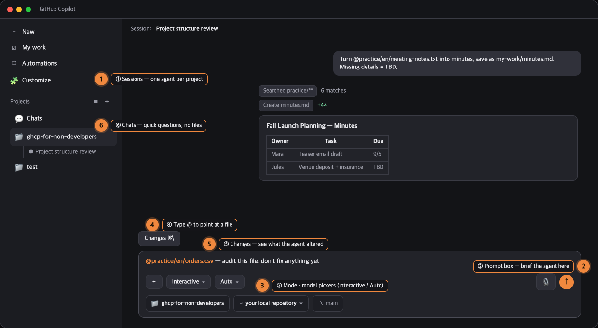
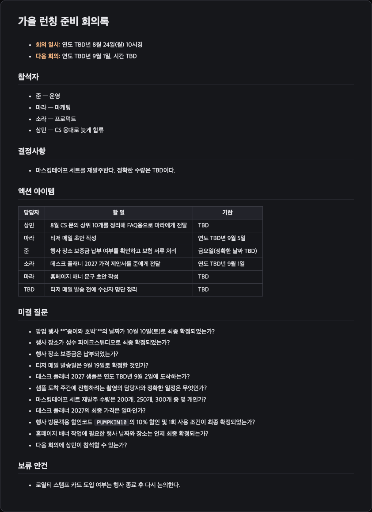
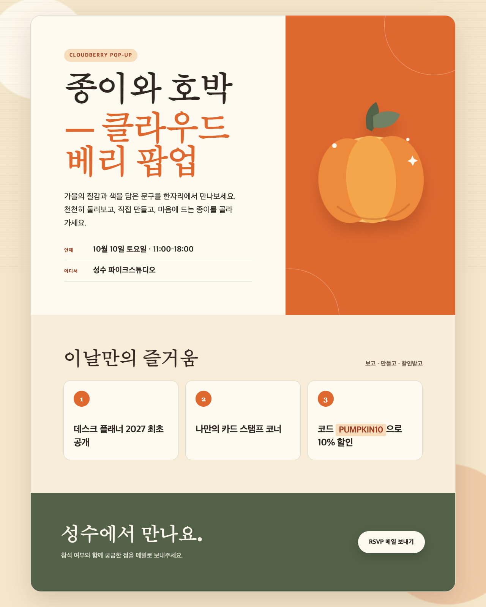
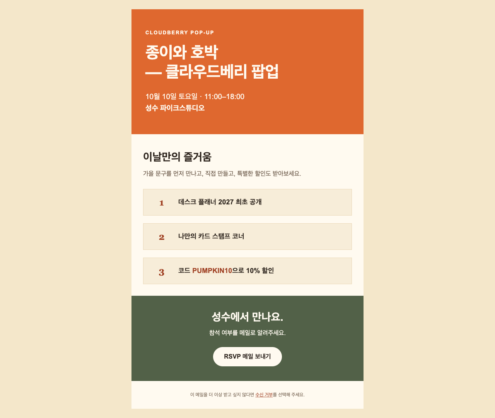

# GitHub Copilot for Non-Developers — Hands-On Labs

> Learn to hand your repetitive desk work — notes, emails, spreadsheets, data, simple web pages — to **GitHub Copilot**, and keep the judgment for yourself. No coding background required.
>
> 🇰🇷 **한국어 가이드** → [README.ko.md](README.ko.md)

**Format:** one storyline, 8 short labs, ~3 hours of core hands-on time · **Tools:** the GitHub Copilot app (Mac/Windows/Linux) · **Audience:** planners, marketers, sales & CS, HR, finance, designers, ops — anyone whose job runs on text and tables.

> ✅ **Field-tested:** the labs *and* bonus labs were executed end-to-end in the GitHub Copilot app (macOS, Aug 2026). The output images in this guide — and everything in [`examples/`](examples/README.md) — come from that verification run.

---

## What you'll walk away with

- A working **GitHub Copilot app** setup you actually know how to drive
- The **ask → check → iterate** habit that separates "AI toy" from "AI coworker"
- Real deliverables you built yourself: meeting minutes, a reply-template kit, working spreadsheet formulas, a cleaned dataset, a web page, and a reusable document template
- A **role playbook** and **prompt cheat sheet** to keep using on Monday

## How this guide works

This is one continuous document in three parts:

1. **① Understand** — a 15-minute read on what Copilot really is for office work, and the two habits (asking well, checking well) everything else depends on.
2. **② Practice** — Labs 0–7, done top to bottom. Every prompt is copy-paste ready. Every lab ends with a ✅ **Checkpoint** so you know you're done.
3. **③ Reference** — role playbooks, prompt patterns, bonus labs, troubleshooting, a glossary, and notes for workshop facilitators.

> 🧵 **The storyline:** you've just joined **Cloudberry Paper Co.**, a 12-person online stationery shop. A fall pop-up event ("Paper & Pumpkin", Oct 10) is coming, a new Desk Planner is launching, and the inbox is on fire. Each lab is one task from your first week. All files, people, and orders in this repo are fictional.

## Table of contents

- [① Understand](#-part-1--understand)
  - [1. Copilot is not just for programmers](#1-copilot-is-not-just-for-programmers)
  - [2. Meet your workbench: the GitHub Copilot app](#2-meet-your-workbench-the-github-copilot-app)
  - [3. How to ask: the four-part request](#3-how-to-ask-the-four-part-request)
  - [4. How to check: you are the editor-in-chief](#4-how-to-check-you-are-the-editor-in-chief)
- [② Practice](#-part-2--practice)
  - [Lab 0 — Set up your workbench](#lab-0--set-up-your-workbench) · [Lab 1 — Messy notes → minutes](#lab-1--from-messy-notes-to-minutes) · [Lab 2 — One reply, three voices](#lab-2--one-reply-three-voices) · [Lab 3 — Formulas without fear](#lab-3--spreadsheet-formulas-without-fear) · [Lab 4 — Rescue a messy dataset](#lab-4--rescue-a-messy-dataset) · [Lab 5 — Your words, on a webpage](#lab-5--your-words-on-a-webpage) · [Lab 6 — The template factory](#lab-6--the-template-factory) · [Lab 7 — Capstone](#lab-7--capstone-ship-something-for-your-actual-job)
- [③ Reference](#-part-3--reference)
  - [Role playbooks](#role-playbooks) · [Prompt patterns](#prompt-pattern-cheat-sheet) · [Bonus labs](#bonus-labs) · [Verification checklist](#the-verification-checklist) · [Troubleshooting](#troubleshooting) · [FAQ](#faq) · [Glossary](#glossary-plain-words-only) · [Facilitator notes](#facilitator-notes)

## What you need

| Item | Required? | Notes |
| --- | --- | --- |
| A GitHub account | ✅ | Free to create at [github.com](https://github.com) |
| GitHub Copilot access | ✅ | **Copilot Free** works for this guide (monthly limits apply). Company accounts: ask your admin. |
| The GitHub Copilot app | ✅ | Free download for Mac/Windows/Linux — [github.com/features/ai/github-app](https://github.com/features/ai/github-app) |
| Git | ✅ | The app's behind-the-scenes save engine — [install guide](https://github.com/git-guides/install-git). One-time setup; you'll never type a git command. |
| This repository | ✅ | The app clones it for you (or Download ZIP) — see Lab 0 |
| A spreadsheet app | ⭕ optional | Excel or Google Sheets, for trying Lab 3's formulas |
| Coding experience | ❌ | Genuinely not needed. You'll type plain English; Copilot types the technical parts. |

---

# ① Part 1 — Understand

## 1. Copilot is not just for programmers

Copilot's reputation — "autocomplete for coders" — hides what it's actually good at: **producing and transforming structured text**. And a surprising amount of office work *is* structured text wearing a costume:

| You already make… | …which is secretly | What that unlocks with Copilot |
| --- | --- | --- |
| Meeting minutes, wikis, checklists | **Markdown** (`.md`) | Draft, restructure, and summarize documents in seconds |
| Spreadsheets & exports | **CSV** + **formulas** | Generate/explain formulas, clean and question data |
| Newsletters, landing pages, invites | **HTML** | Build real, openable pages by describing them |
| App settings, form exports | **JSON / YAML** | Read and edit "scary config" with a translator at your side |
| "Can we get the numbers for…" | **SQL** | Turn plain questions into queries analysts can run |

Three beliefs tend to block non-developers. Let's retire them now:

| The belief | What this guide will show you |
| --- | --- |
| *"I'd have to learn to code first."* | You write the **request** in plain language; Copilot writes the technical artifact. Your job is to specify and to judge — skills you already have. |
| *"It's just a chatbot in a different window."* | Unlike a web chatbot, Copilot sits **next to your files**. It can read the actual meeting notes, edit the actual CSV, and create the actual HTML file — no copy-paste shuttling. |
| *"AI output can't be trusted for real work."* | Correct — **unverified** output can't be. So this guide builds a checking habit into every single lab. Trust is a workflow, not a feeling. |

## 2. Meet your workbench: the GitHub Copilot app

Why a desktop app and not a browser chatbot? Because your **files and the AI share one place**. The GitHub Copilot app is built for *directing* AI agents: you describe work in a session, an agent reads your project's actual files, writes real files back, and asks your approval before it acts. It's free to download, runs on Mac, Windows, and Linux, and — despite being built for developers — you only need **six things**:



*Schematic of the real app layout (simplified; your version may differ in small ways).*

| # | Thing | Where | What it's for |
| --- | --- | --- | --- |
| 1 | **Sessions** (+) | Sidebar | One session = one conversation with an agent working inside your project |
| 2 | **Prompt box** | Bottom of a session | Where you brief the agent |
| 3 | **Mode & model pickers** | Dropdowns below the prompt box | Interactive / Plan / Autopilot · model **Auto** is fine |
| 4 | **`@` file reference** | Typed in the prompt box | Point the agent at a specific file (`@practice/en/orders.csv`) |
| 5 | **Changes** | Above the prompt box | See exactly what the agent altered |
| 6 | **Chats** | Sidebar | Quick questions that involve no files at all |

Everything else — My work, Automations, Canvases — can stay a mystery for now.

### The three session modes (plus Chats)

| Mode | What it does | Reach for it when… |
| --- | --- | --- |
| **Interactive** | You and the agent take turns; it suggests, you steer | The default for every lab in this guide |
| **Plan** | The agent writes a plan first; you approve it before anything runs | Bigger jobs you want to preview — try it in Lab 7 |
| **Autopilot** | The agent runs to completion without waiting for you | Only when your brief is airtight |
| **Chats** (sidebar) | A plain conversation — no project, no files touched | File-less questions; Lab 3 works here too |

> 💡 **Rule of thumb:** stay in **Interactive** and let the agent do the typing. When it asks permission before creating a file or running a command, that's a feature, not friction — read the request, then approve.

## 3. How to ask: the four-part request

The difference between a shrug and a spot-on answer is usually the request, not the model. A reliable request has four parts — think of writing a **work order for a very fast new teammate who knows nothing about your company**:

| Part | Question it answers | Example fragment |
| --- | --- | --- |
| **Goal** | What do I want back? | "Draft a reply to this customer email." |
| **Context** | What should you look at / know? | "Use the attached message. We're a small stationery shop; the delay was a courier error." |
| **Format** | What shape should it take? | "Under 150 words, subject line included, plain warm English." |
| **Guardrails** | What must / must not happen? | "Apologize once, don't blame the courier, offer replacement or refund. Don't invent order details." |

Before and after, same task:

> ❌ "write a reply to this customer"
>
> ✅ "Draft a reply to the attached customer email. Context: we're a 12-person stationery shop; the wrong item shipped and it arrived late. Format: under 150 words with a subject line, warm but professional. Guardrails: apologize once without blaming anyone, offer a replacement plus a small make-good OR a full refund including delivery, and don't state anything the customer didn't say."

You don't need all four parts every time — but when an answer disappoints, check which part you left out. Usually that's the fix.

## 4. How to check: you are the editor-in-chief

Copilot is a confident drafter, not a source of truth. It can misread a number, "helpfully" fill a gap with something plausible, or produce a formula that's almost right. None of that is a problem **if checking is part of your workflow**:

1. **Pin the facts.** After a draft, scan every name, date, number, and commitment against the source. (Labs bake in the instruction *"if a detail is missing, write TBD — don't invent it"* — steal that line forever.)
2. **Recompute one thing.** If Copilot summed revenue, pick one row and check the math yourself. One honest spot-check catches most systematic errors.
3. **Make it confess.** Ask: *"List any assumptions you made and anything you weren't sure about."* This one prompt surfaces a surprising number of silent guesses.
4. **Test before you trust.** For formulas and pages: ask for tiny test cases, try them, then adopt.
5. **Mind what you paste.** Practice files here are fictional. At work, follow your company's AI policy — keep real customer data, credentials, and unreleased financials out of any AI tool unless your organization explicitly allows it.

> 🔑 If you remember one sentence from Part 1: **you're not learning to code — you're learning to brief and to review.** Both are things good managers already do.

---

# ② Part 2 — Practice

> 👉 Do the labs **top to bottom**. Type or paste each prompt block into the session's prompt box, then hit the ✅ **Checkpoint** before moving on. Your answers will differ from your neighbor's — that's how generative AI works, and the checkpoints account for it.
>
> 🆘 Stuck? [`examples/`](examples/README.md) holds the actual outputs from our verification run — compare the structure, don't copy the words.

## Lab 0 — Set up your workbench

> 🎯 Install, sign in, connect this project, say hello · ⏱️ ~15 min

**1. Install Git** → [github.com/git-guides/install-git](https://github.com/git-guides/install-git). It's the save-and-versioning engine the Copilot app uses under the hood — install once, then forget it exists.

**2. Install the GitHub Copilot app** → [github.com/features/ai/github-app](https://github.com/features/ai/github-app) — download for your platform and open it.

**3. Sign in:** click **Sign in to GitHub** and follow the prompts. No paid plan? **Copilot Free** is enough for this guide. (If onboarding asks you to select repositories, you can skip — we'll connect the project next.)

**4. Connect this project:** click **+** next to **Projects** in the sidebar, then pick one from the menu:

- **Clone repository** (no other tools needed): paste `https://github.com/junwoojeong100/ghcp-for-non-developers.git` — the app clones the project for you. Note where it puts the folder.
- **Open folder:** if you already grabbed this repo (green **Code** button → **Download ZIP** → unzip somewhere easy), select that folder.

*(Menu labels drift between app versions — look for the option that clones from a URL or opens a local folder.)*

**5. Start your session:** click **+** next to **Projects** and pick your project under *start session in* (or click the ➕ **New session** icon on the project's row). In the dropdowns below the prompt box choose **Interactive** mode and the **Auto** model. The **Workspace** picker decides where files land: choose **your local repository** so everything the agent saves appears right in your folder. (The default, *New worktree*, works too — outputs then live in a working copy the app manages, visible via **Changes**.) Then send your first request:

```text
Introduce yourself in two sentences. Then look at the folder structure of this
project and tell me, in plain language, what you think the practice/ folder is for.
```

**6. Make your workspace** — let the agent do it:

```text
Create an empty folder called my-work in this project. All my lab outputs
will go there.
```

If it asks for approval, approve — routine file work inside the workspace may simply proceed and report back. Everything you produce in Labs 1–7 lives in `my-work/`.

✅ **Checkpoint:** the agent replied, described `practice/` sensibly, and confirmed `my-work/` exists (want proof? ask `list the top-level folders in this project`). Stuck? See [Troubleshooting](#troubleshooting).

> 🧭 **Keep using this one session for all the labs.** Coming back another day, or the session feels sluggish? Start a fresh one in the same project — your files live on disk, not in the chat.

---

## Lab 1 — From messy notes to minutes

> 🎯 Turn raw meeting scribbles into minutes people can act on · ⏱️ ~20 min · 📁 `practice/en/meeting-notes.txt`

**Story:** Monday, 10:47 AM. Jules from ops drops a wall of launch-meeting notes into the team channel: *"can someone make this readable before the 1pm sync?"* That someone is you.

**1.** Peek at the mess first: open the project folder in Finder / File Explorer and double-click `practice/en/meeting-notes.txt` — or ask the agent: `Show me practice/en/meeting-notes.txt exactly as it is, unchanged.` Notice the half-decisions ("300 units. or was it 200?") and buried to-dos.

**2.** In the prompt box, send the brief. The `@` pulls the file into context — type `@` and pick it, or just write the path:

```text
Read @practice/en/meeting-notes.txt and turn it into clean meeting minutes in
Markdown, saved as my-work/minutes.md. Sections: # Fall Launch Planning — Minutes,
then Attendees / Decisions / Action Items / Open Questions / Parking Lot.
Action Items must be a table with Owner, Task, Due date. Important: if a detail
is unclear or missing in the notes, write TBD — do not invent or guess anything.
When you're done, show me the finished minutes here in the chat too.
```

If the agent asks to approve the write, approve — it may also just save the file and tell you where it is.

**3.** Read the result **against the original**. The reorder quantity was never settled — did Copilot put it under *Open Questions* (good) or state a number as fact (call it out and ask for a fix)? Notice, too, that the minutes render in the chat as real headings and tables — that's Markdown doing its job.

**4.** Iterate — the real skill. Keep the conversation going:

```text
Good. Now: (1) rewrite Action Items as checkbox lists grouped by owner,
(2) add a "TL;DR" section at the top with the 3 most important points,
(3) keep everything else exactly as it is. Update my-work/minutes.md and
show me the result.
```

✅ **Checkpoint:** the minutes show a TL;DR and checkbox action items per owner, the reorder quantity appears as an open question or TBD — not as an invented fact — and `my-work/minutes.md` exists in your project folder.



*Actual `minutes.md` produced during verification (Korean edition — yours will be in your language). Note the reorder quantity: an open question, not an invented number.*

💡 **Going further:** `Draft a 5-line follow-up message to the team asking owners to confirm their action items by Friday.`

---

## Lab 2 — One reply, three voices

> 🎯 Answer a tricky customer email, then turn the answer into a reusable asset · ⏱️ ~15 min · 📁 `practice/en/customer-message.txt`

**Story:** Sam from CS forwards you a message from Noah — late delivery *and* the wrong sticker pack, a three-time customer, gift ruined. Sam's note: *"Handle this one with care, and can we make a template out of it? We get this pattern weekly."*

**1.** Open and read `practice/en/customer-message.txt` (double-click it in your file manager, or ask the agent to show it unchanged).

**2.** Send the four-part request, pointing at the file with `@`:

```text
Draft a reply to the customer email in @practice/en/customer-message.txt.
Context: we're Cloudberry Paper Co.,
a small stationery shop; a courier mix-up caused both the delay and the wrong item.
Format: under 150 words, include a subject line, warm and human, no corporate filler.
Guardrails: apologize once (no over-apologizing, no blaming the courier), offer BOTH
options the customer raised — correct pack + a make-good, or full refund including
delivery — and confirm we'll act within 2 business days. Use only facts from
the customer's message.
```

**3.** Verify like an editor: does the draft cite the right order number (1006), the right packs (Forest vs Ocean), the right dates? Did it promise anything Noah never asked for? Fix by instruction, not by hand:

```text
Remove the discount-code offer — we can't promise that. Keep everything else.
```

**4.** Multiply the formats:

```text
Now give me: (1) three alternative subject lines from safe to friendly,
(2) a 2-sentence SMS version, (3) a one-line internal note telling Sam
what we offered.
```

**5.** Turn it into an asset. This is the step most people skip:

```text
Convert the reply into a reusable template for "late delivery + wrong item" cases.
Replace specifics with {placeholders} like {customer_name}, {order_id}, {wrong_item},
{right_item}. Add at the top: a one-line "When to use" note and a 3-item checklist
of what to verify before sending.
```

**6.** Save the template: `Save that template as my-work/cs-reply-template.md` — approve the write.

✅ **Checkpoint:** your template has placeholders, a when-to-use note, and a pre-send checklist — and the original reply mentions order 1006 and both resolution options.

💡 **Going further:** `Using the same structure, draft a template for "item arrived damaged" — invent nothing about our policies; leave policy details as {placeholders}.`

---

## Lab 3 — Spreadsheet formulas without fear

> 🎯 Generate formulas from plain language, decode someone else's monster formula, and test before trusting · ⏱️ ~20 min · 🧰 no files involved — a sidebar **Chat** works too

**Story:** Priya maintains the inventory sheet. Her status is "on leave, do not text me formulas questions." Column layout you inherit: **A** product, **B** order date, **C** qty, **D** unit price, **E** channel.

**1. Describe → formula.** In your session (or a fresh **Chat** from the sidebar — this lab touches no files):

```text
I have an Excel sheet: column A product name, B order date, C quantity,
D unit price, E channel ("web", "retail", "pop-up"). Give me formulas for:
1. Total August 2026 revenue for the product "Washi Tape Set"
2. A "FLAG" in a helper column when quantity is blank, zero, or negative
3. Revenue per row that's safe even when quantity is blank
For each: the Excel formula, the Google Sheets version if different, and a
one-sentence plain-language explanation.
```

**2. Demand the explanation you actually need.** Pick the formula that scares you most:

```text
Explain formula #1 piece by piece, like I'm comfortable with Excel basics
but have never used this function. What breaks if a date in column B is
text instead of a real date?
```

(That last question is not academic — you saw those mixed date formats in the meeting-notes chaos, and you'll meet them again in Lab 4.)

**3. Decode a monster.** Someone left this in the inventory sheet. Paste it in:

```text
What does this formula do, in plain language? Is anything fragile or wrong
with it? Then give me a simpler modern version (XLOOKUP or IFERROR are fine)
and say why yours is safer:

=IF(ISNA(VLOOKUP(A2,Sheet2!$A$2:$C$50,3,FALSE)),"MISSING",
 IF(VLOOKUP(A2,Sheet2!$A$2:$C$50,3,FALSE)>=250,"OK","REORDER"))
```

**4. Test before you trust.** The habit that makes you dangerous (in a good way):

```text
Give me 3 tiny test cases for the FLAG formula: the values I should type into
a blank sheet (A2:E4 is enough) and the exact result I should expect in each
case, including one edge case designed to catch a subtle bug.
```

If you have Excel or Google Sheets handy, actually run one test case. Two minutes, real confidence.

✅ **Checkpoint:** you have three working formulas with explanations, a plain-language read of the monster formula plus a simpler rewrite, and at least one test case you could run.

💡 **Going further:** `Write a conditional-formatting rule that turns a row light red when the FLAG column says FLAG — with click-by-click setup steps for Excel.`

---

## Lab 4 — Rescue a messy dataset

> 🎯 Audit → clean → question a real-world-messy CSV, and spot-check the answers · ⏱️ ~25 min · 📁 `practice/en/orders.csv`

**Story:** Mara wants a simple sales read-out for the launch planning: *"top products, revenue by channel, nothing fancy."* Then you open `orders.csv`. Three date formats. A duplicate row. A negative quantity. Blank cells. A city spelled four ways. Welcome to real data.

**1.** Open `practice/en/orders.csv` (your file manager will hand it to Excel or a text editor — either is fine) and eyeball it. Spot three problems yourself before asking — it sharpens your review of Copilot's audit.

**2. Audit first, fix second.** Send:

```text
Audit @practice/en/orders.csv for data-quality problems. Do NOT fix anything yet.
List every issue you find, grouped by column, with the affected order_id(s)
and why it's a problem for analysis.
```

Compare with your own three finds. Did it catch the duplicate `1007`? The trailing space in `"Portland "`? The negative quantity (probably a refund — a *meaning* question, not just a formatting one)?

**3. Now fix — with a paper trail:**

```text
Create a cleaned version: dates → YYYY-MM-DD; trim spaces; normalize city and
product capitalization (e.g., "gel pen 0.5mm" → "Gel Pen 0.5mm"); remove exact
duplicate rows. Do NOT delete rows with missing or negative values — leave them
but list them separately as "needs human decision". Output: (1) the full cleaned
CSV in a code block, (2) a change log table: order_id, column, before, after,
reason.
```

**4.** Save it: `Save the cleaned CSV as my-work/orders-clean.csv` — approve the write.

**5. Ask the data questions — with the math shown:**

```text
Using the cleaned data (excluding the rows flagged for human decision):
1. Top 3 products by revenue (qty × unit_price)
2. Revenue by channel, with % of total
Show the intermediate arithmetic for #1 so I can spot-check it, and state
every assumption you made about the excluded rows.
```

**6. The spot-check.** Pick one product and verify its revenue yourself — mental math or a calculator, one minute. If it matches, you can present these numbers. If not, say so in chat and watch Copilot re-derive.

✅ **Checkpoint:** `my-work/orders-clean.csv` exists, you have a change log, an answer for top products / channel split — and **you personally verified one number**.

💡 **Going further:** `Write step-by-step instructions to redo this exact cleanup in Excel using Power Query, for a colleague who has never opened it.` · Curious about SQL? → [Bonus Lab B1](#bonus-lab-b1--a-taste-of-sql).

---

## Lab 5 — Your words, on a webpage

> 🎯 Have your agent build — and rebuild — a real, openable web page · ⏱️ ~25 min · 🧰 zero HTML knowledge required

**Story:** The "Paper & Pumpkin" pop-up needs an invite page *today*. The agency wants two weeks. Mara looks at you: *"You've got that AI thing, right?"*

**1.** Stay in your session and send the whole brief at once:

```text
Create a one-page event invite at my-work/invite.html. Single HTML file, no
external libraries, styles inside the file.
Content: headline "Paper & Pumpkin — a Cloudberry pop-up"; Saturday Oct 10,
11:00–18:00; Pike St Studio; three highlights (first look at the Desk Planner
2027, stamp-your-own card corner, 10% off with code PUMPKIN10); an RSVP button
that opens an email to rsvp@cloudberry.example.
Design: warm paper-and-pumpkin palette, generous whitespace, big readable type,
must look good on a phone.
```

The agent will propose creating the file — **review, then approve**. (Curious what it wrote? Click **Changes** above the prompt box.)

**2.** Open your page like a normal person: find `my-work/invite.html` in your project folder (Finder / File Explorer) and double-click — a browser opens **your** page. Or ask the agent: `Open my-work/invite.html in my default browser` and approve the command.

**3. Iterate in plain language.** One change per message; refresh the browser after each approval:

```text
Make the headline noticeably bigger, and add a 3-question FAQ section above the
RSVP button (parking? kids welcome? card payments?). Answer with sensible
placeholder text I can edit.
```

```text
The orange feels harsh. Shift the palette toward cream and terracotta, and make
the RSVP button impossible to miss.
```

**4. The readability pass** — carry your verification habit into design:

```text
Review this page for readability and accessibility: text-background contrast,
font sizes on mobile, and whether the RSVP link works as written. Fix what's
wrong and tell me what you changed.
```

✅ **Checkpoint:** `invite.html` opens in your browser, survived at least two rounds of your feedback, includes the FAQ, and passed a readability check.



*The actual page an agent built from this lab's brief during verification — zero HTML was written by a human.*

💡 **Going further:** `Create my-work/planner.html — a product one-pager for the Desk Planner 2027 in the same style: hero, 3 feature blocks, price 18.50, "notify me" mailto button.`

---

## Lab 6 — The template factory

> 🎯 Produce a polished document for your role, then extract a reusable template from it · ⏱️ ~20 min

**Story:** the launch went well. Now three people want your help at once. Pick **one** track — whichever is closest to your actual job:

| Track | Who asked | The deliverable |
| --- | --- | --- |
| **A · Planning** | Priya | A one-page brief for the "loyalty stamp card" idea from the meeting's parking lot |
| **B · People** | Jules | A job post + interview kit for a part-time shop assistant (pop-ups outgrew the team) |
| **C · Sales** | Mara | A one-page wholesale proposal for a boutique that visited the pop-up |

**1. Generate the filled example first.** Take your track's prompt:

**Track A:**

```text
Write a one-page product brief in Markdown for "Cloudberry loyalty stamp cards"
(physical stamp card; a free Gel Pen after 5 purchases). Sections: Problem,
Who it's for, Proposal, What success looks like (2–3 measurable signals),
Scope — in / out for v1, Risks & open questions. Tone: plain and specific,
no buzzwords. Mark anything you had to assume with (assumption).
```

**Track B:**

```text
Write in Markdown: (1) a job post for a part-time shop assistant at Cloudberry
Paper Co. — 12-person stationery shop, weekend pop-ups, warm and honest tone,
sections for role / you'll do / you might be / practical details as {placeholders};
(2) six interview questions — 3 behavioral, 3 situational — each with 2–3 bullet
"signals of a strong answer". No questions about protected personal traits.
```

**Track C:**

```text
Write a one-page wholesale proposal in Markdown from Cloudberry Paper Co. to a
boutique gift shop. Sections: Why our products fit your store, Suggested starter
assortment (use products like the Dot Grid Notebook A5, Washi Tape Set,
Desk Planner 2027), Wholesale terms as a table with {placeholder} numbers,
Next steps. Persuasive but concrete — no filler adjectives.
```

**2. Review it like the recipient.** Would Priya see a measurable success signal? Would a candidate know if they should apply? Would the boutique owner know what to do next? Push back on the weakest section:

```text
The {weakest section} is generic. Rewrite it twice as concrete, and ask me
2 questions whose answers would improve it further.
```

(Answer its questions — watch the doc get better. This back-and-forth *is* the skill.)

**3. Extract the template** — turn one good document into infinite ones:

```text
Now convert this into a reusable template: replace every case-specific detail
with {descriptive_placeholders}, keep the structure and section guidance, and
add a "Before you send" checklist of 5 quality questions at the bottom.
```

**4.** Save both: `my-work/draft-<track>.md` and `my-work/template-<track>.md`.

✅ **Checkpoint:** two files — one filled example that survived your critique, one placeholder template with a quality checklist.

💡 **Going further:** the app ships a built-in critic — type `/rubber-duck` in the prompt box and ask it to poke holes in your draft. Or cast the critic yourself: `Critique my filled draft as a skeptical director would: list the 5 hardest questions I'd get, with a suggested answer for each.`

---

## Lab 7 — Capstone: ship something for your actual job

> 🎯 No script this time. Pick a mission, brief Copilot yourself, iterate to "shippable" · ⏱️ ~30 min

Choose the mission closest to your real Monday (or invent your own — better!). For each mission: the **Definition of Done** is your checkpoint, and every prompt is yours to write. Use the four-part request; use the verification checklist.

| Mission | Build | Definition of Done |
| --- | --- | --- |
| 📣 **Marketing** | Post-event thank-you email + 3 social posts + a 5-line results blurb for the team | Consistent voice across all pieces; every number traceable to Lab 4's data or marked {TBD} |
| 📋 **Planning / PM** | A one-page FAQ + rollout note for the loyalty stamp cards (build on Lab 6A) | Covers the 5 questions staff will actually get; no invented policy — gaps say {TBD} |
| 🎧 **CS** | A macro pack: 5 reply templates for your team's top 5 real inquiry types | Each has placeholders, a when-to-use line, and a pre-send check |
| 🧑‍🤝‍🧑 **HR / People** | Week-1 onboarding plan for the new shop assistant (build on Lab 6B) | Day-by-day table, owner per item, works as a Markdown checkbox list |
| 💰 **Finance / Ops** | A monthly sales close kit: cleaned-data checklist + 3 reusable formulas + a summary template | A colleague could run the close using only your kit |
| 🗂️ **Your own** | The document/page/template you keep re-making at work | You'd genuinely use it next week |

**A working rhythm that works:**

1. Brief with the four parts (goal · context · format · guardrails) — one message
2. Review against the source; make it confess assumptions
3. Iterate — "keep X, change Y", one or two changes per message
4. Extract the reusable version (template, checklist, or kit)
5. Save it in `my-work/` — that folder is now your portfolio

> 💪 Brief feeling airtight? This is the moment to try the other session modes: **Plan** (approve the plan, then let it run) or, for the brave, **Autopilot**.

✅ **Checkpoint:** one mission's Definition of Done is fully met, and you never accepted a fact you didn't check.

🎉 **Done!** You've briefed, built, verified, iterated, and shipped — with files, not just chat bubbles. That's the whole game. The reference below is for the rest of the year; the labs were just the first week.

---

# ③ Part 3 — Reference

## Role playbooks

Three prompts per role to run **this week** — swap the {placeholders} for your reality. All follow the four-part shape; tighten guardrails for your company.

<details>
<summary><b>📋 Planning / PM</b></summary>

```text
Turn these raw notes into a decision log: decision, options considered, who
decided, date, revisit-when. Anything undecided goes to "open questions" — don't
resolve it for me. <paste notes>
```

```text
Here's a feature idea in 3 sentences. Write the 10 questions a skeptical
engineer, a designer, and a CS lead would each ask before agreeing to build it.
<idea>
```

```text
Rewrite this update three times: 2 lines for execs, 6 lines for the team,
1 friendly line for the company chat. Same facts, no new claims. <update>
```

</details>

<details>
<summary><b>📣 Marketing</b></summary>

```text
Here's one product description. Give me 5 headline options across a
safe→playful spectrum, each with a one-line rationale and the audience it fits.
<description>
```

```text
Draft a 3-email sequence (announce / remind / last-call) for {event}. Shared
skeleton, escalating urgency without being pushy, subject + preview text for
each, all dates as {placeholders}.
```

```text
Audit this landing copy against this checklist: one clear promise, evidence,
single CTA, no jargon, scannable in 10 seconds. Score each, then rewrite the
weakest two parts. <copy>
```

</details>

<details>
<summary><b>🎧 Sales & CS</b></summary>

```text
Classify these 20 support messages into 5–7 inquiry types with counts, then
tell me which type deserves a template first and why. <paste messages>
```

```text
Draft a renewal check-in email to a customer whose annual plan ends {date}.
Warm, zero pressure, one clear question. Then a variant for someone who had a
support issue last month.
```

```text
Turn this pricing sheet into a one-page quote: line items table, subtotal,
{discount} row, validity date, next steps. Flag any place I must fill numbers
by hand. <pricing>
```

</details>

<details>
<summary><b>🧑‍🤝‍🧑 HR / People</b></summary>

```text
Rewrite this job post to be concrete and honest: cut buzzwords, split
must-have vs nice-to-have, add "what a normal week looks like". Keep it under
350 words. <post>
```

```text
Build a structured interview kit for {role}: 6 questions mapped to the 3
competencies that matter most, each with strong/weak answer signals. Exclude
anything touching protected traits.
```

```text
Draft a week-1 onboarding checklist for {role} as a Markdown checkbox list
grouped by day, with an owner column. Leave tool names as {placeholders}.
```

</details>

<details>
<summary><b>💰 Finance / Ops</b></summary>

```text
Here are my sheet's columns: <list>. Give me formulas for {metric}, in Excel
and Google Sheets, each with a plain explanation and one test case I can
verify in a blank sheet.
```

```text
This export has mixed date formats, stray spaces, and duplicates. Audit first
(grouped by column), then give me a cleaned version plus a change log —
never delete rows with missing values, flag them. <paste sample>
```

```text
Turn this month-end process I typed from memory into a numbered runbook with
checkpoints ("you should now see…"), so a colleague could run it without me.
<process>
```

</details>

<details>
<summary><b>🎨 Design</b></summary>

```text
Here's rough copy for a page. Propose an information hierarchy: what's the one
message, what supports it, what's cuttable. Then rewrite the copy in that
order. <copy>
```

```text
Build my-work/style-tile.html: our palette {colors}, type scale from 14 to 40px,
buttons in default/hover/disabled — one file, labeled swatches, openable in a
browser.
```

```text
Check this page's colors for WCAG contrast: list each text/background pair,
pass or fail, and the closest passing alternative that keeps the vibe.
<paste CSS or attach file>
```

</details>

<details>
<summary><b>🗂️ Office / Admin</b></summary>

```text
Draft a file-naming convention for {team}: pattern, 10 worked examples
covering our real document types, and a 5-line "how to decide" note.
```

```text
Turn this email thread into: what was decided, who owes what by when, and a
draft reply that closes the loop politely. <paste thread>
```

```text
Make a reusable agenda template for our {weekly} meeting: timeboxes, owner
column, a parking-lot section, and a 3-line "how to run this" note at top.
```

</details>

<details>
<summary><b>📊 Data-curious</b></summary>

```text
Attached is a CSV. Before any analysis: what questions CAN this data answer,
what questions can it NOT answer, and what's missing that I'd need to collect?
```

```text
Answer "{business question}" from the attached data. Show intermediate steps
so I can spot-check one, and state assumptions about excluded rows.
```

```text
I'm presenting these numbers to {audience}. Draft the 5-slide storyline:
one message per slide, the number that proves it, and the caveat I must say
out loud.
```

</details>

## Prompt pattern cheat sheet

| Pattern | Say it like | Use when |
| --- | --- | --- |
| **Four-part request** | goal + context + format + guardrails | Every substantial ask |
| **No-invention rule** | "If a detail is missing, write TBD — don't invent it." | Summaries, minutes, anything factual |
| **Audit first** | "List the problems. Do NOT fix anything yet." | Data, documents, anything you'll be blamed for |
| **Paper trail** | "…plus a change log: what changed, where, why." | Any cleanup or edit you must be able to explain |
| **Keep X, change Y** | "Keep the structure; only rework the tone of section 2." | Iterating without collateral damage |
| **Make it confess** | "List your assumptions and anything you weren't sure about." | Before you trust an answer |
| **Test cases, please** | "Give me 3 tiny test cases with expected results." | Formulas, rules, anything that computes |
| **Show the math** | "Show intermediate steps so I can spot-check one." | Sums, rankings, percentages |
| **Template-ify** | "Replace specifics with {placeholders}; add a pre-send checklist." | Turning one good output into a reusable asset |
| **Harsh critic** | "Critique this as a skeptical {director} would — 5 hard questions." | Before anything goes to someone important |
| **Audience switch** | "Rewrite for {execs / new hires / customers}; same facts, no new claims." | One document, many readers |
| **Teach me this** | "Explain piece by piece for someone comfortable with {basics} only." | Inherited formulas, config, jargon |

## Bonus labs

### Bonus Lab B1 — A taste of SQL

SQL is the language of "can we get the numbers" — and you now know enough to *read* it. In your session:

```text
Pretend @practice/en/orders.csv is a database table called orders. Write SQL for:
1. Revenue by product, highest first
2. Orders per channel in August 2026
3. Customers who ordered more than once
Explain each query line by line in plain language, and tell me which of my
data-quality problems from earlier would silently corrupt these results.
```

That last clause is the point: dirty data doesn't error, it lies. You don't need a database today — being able to read a query and question its inputs already changes your conversations with analysts.

### Bonus Lab B2 — An email that survives inboxes

Web pages and HTML emails are different beasts (email clients are stuck in the past — tables and inline styles win). Send:

```text
Create my-work/newsletter.html: an HTML email announcing the Paper & Pumpkin
pop-up. Email-client-safe (table-based layout, inline styles, no external
resources), max 600px wide, one hero section, three highlights, one button
(RSVP), and a plain-text footer with an {unsubscribe_link} placeholder.
Then list the 5 things that make an HTML email different from a web page.
```

Open it in your browser to preview. Sending it is your email tool's job; building it no longer requires a vendor.



### Bonus Lab B5 — A designer's style tile

Cloudberry's look currently lives in people's heads. Fix that with one brief:

```text
Create my-work/style-tile.html: Cloudberry's visual language on one page —
color swatches (paper cream, pumpkin, ink, leaf green) with hex codes, a type
scale from 14 to 40px using system fonts, and buttons in default/hover/disabled
states. One self-contained file. Then check every text/background pair for
WCAG contrast and fix any failures.
```

✅ Open it in your browser — your team now has a visual reference to point at.

### Bonus Lab B6 — A finance month-end mini kit

Turn Labs 3–4 into a repeatable process instead of a one-off rescue:

```text
Using @practice/en/orders.csv as the worked example, build my-work/close-kit.md:
(1) a pre-close data checklist based on the problems we found in Lab 4,
(2) the three formulas from Lab 3 with one test case each,
(3) a monthly summary template with {placeholders}.
A colleague should be able to run the close with only this file.
```

✅ The kit stands alone — no chat history required to use it.

### Bonus Lab B7 — An analyst's dashboard spec

The fastest way to get a dashboard built is a spec nobody can misread:

```text
From the cleaned version of @practice/en/orders.csv, draft my-work/dashboard-spec.md:
the 3 business questions this dashboard answers, one metric per question with
its exact formula, the chart type that fits each metric, and the data fields
required. Explicitly flag anything this dataset cannot answer.
```

✅ Every metric traces to a question, every chart to a metric — and the dataset's limits are named.

### Bonus Lab B3 — Let the agent do the filing

Your agent can act on the **whole project** — the beginning of real automation. Try:

```text
Look at everything inside my-work/ and create my-work/README.md: a table of
each file, what it is, which lab produced it, and a one-line description.
Add a "portfolio summary" paragraph at the top I could paste into a
self-review.
```

Watch it read, plan, and ask approval before writing. That review-approve loop is exactly how you keep automation safe while it saves you time. Then peek at **Automations** in the app's sidebar: the same request, saved as a task, can run on a schedule or on demand — filing that files itself.

### Bonus Lab B4 — A taste of the terminal (Copilot CLI)

Strictly optional, for the curious: the engine inside the Copilot app is [GitHub Copilot CLI](https://docs.github.com/copilot/concepts/agents/about-copilot-cli) — and you can drive it directly **in the terminal**, no windows at all. With Node.js 22+ installed:

```bash
npm install -g @github/copilot
cd ghcp-for-non-developers
copilot
```

Trust the folder when asked, then try Lab 1 without a mouse:

```text
Turn practice/en/meeting-notes.txt into Markdown minutes and save them as
my-work/minutes-cli.md. If a detail is missing, write TBD — don't invent it.
```

It plans, asks approval, writes the file. Notice what *didn't* change: the four-part request and the verification checklist work in every Copilot surface — app, terminal, or web. Tools rotate; the briefing-and-reviewing skill is yours for good.

## The verification checklist

Print-worthy. Before any Copilot output leaves your hands:

- [ ] **Facts:** every name, date, number, commitment checked against the source
- [ ] **One recompute:** at least one calculation verified by hand
- [ ] **Confession:** you asked for assumptions/uncertainties and read them
- [ ] **Gaps say TBD:** unknowns are marked, not filled with plausible fiction
- [ ] **Test ran:** formulas/pages tried once before adoption
- [ ] **Data hygiene:** nothing pasted that your company's AI policy wouldn't allow

## Troubleshooting

| Symptom | Try this |
| --- | --- |
| The app won't install or open | Re-download from [github.com/features/ai/github-app](https://github.com/features/ai/github-app) (Mac/Windows/Linux). Still stuck? Update your operating system and retry. |
| "Sign in" loops or fails | Sign out from the app's settings and back in. Company account? Ask your admin — the **GitHub Copilot app** policy must be enabled (it is by default). |
| The app complains that Git is missing | Install it from [github.com/git-guides/install-git](https://github.com/git-guides/install-git), then restart the app. You'll never touch it again. |
| The agent talks about the wrong file / "I don't see a file" | Reference it explicitly: type `@` in the prompt box and pick the file. Also double-check the session was started in the right project. |
| The agent keeps asking for approval | Normal and good — it must ask before creating files or running commands. Read, then approve. |
| Replies come in the wrong language | Say `Answer in English` (or 한국어) once; it sticks for the session. |
| "You've reached your limit" on Copilot Free | Free has monthly caps. Wait for reset, or upgrade — the labs also work fine spread across days. |
| The response is mediocre | It's usually the request. Add the missing part: goal, context, format, or guardrails — then ask again. Regenerating without changing the ask rarely helps. |
| Can't find the mode/model dropdowns | They sit just below the prompt box inside a session. If your app looks different, update it — the UI evolves. |

## FAQ

**My output is different from the guide's description. Broken?**
No — generative AI varies run to run. That's why every lab checks *properties* ("has a TL;DR", "quantity is an open question") rather than exact text.

**Is my data used to train models?**
Depends on your plan and organization settings — ask your admin, read your company's AI policy, and until then keep real customer/financial data out. The practice files here are fictional precisely so you can play freely.

**Why a desktop app instead of a chatbot website?**
Files, and hands. A web chatbot can only talk; the Copilot app's agent reads your actual CSV and writes an actual HTML file next to it — no copy-paste tax. You're not chatting about the work, you're directing it.

**Do I need to remember any syntax?**
No. You need the four-part request and the verification checklist. Syntax is Copilot's job; judgment is yours.

**Copilot said something confidently wrong. Should I trust it less?**
Trust it exactly as much as a fast, tireless, occasionally overconfident new teammate: great first drafts, everything reviewed. The checklist exists because "confidently wrong" is a known failure mode — of AIs and humans alike.

## Glossary (plain words only)

| Term | Meaning here |
| --- | --- |
| **Repository (repo)** | A project folder that lives on GitHub. This guide is one. |
| **Clone / Download ZIP** | Two ways to copy a repo to your computer (git-flavored / plain). |
| **Git** | The versioning engine the app uses to keep work safe. Installed once, then invisible. |
| **GitHub Copilot app** | The desktop app where you direct AI agents that work on your project's files. Our workbench. |
| **Session** | One conversation with one agent inside one project. Lives in the app's sidebar. |
| **Markdown (.md)** | Plain text with light symbols (`#`, `-`, `\|`) that render as headings, lists, tables. |
| **Changes** | The app's view showing exactly what the agent modified. |
| **CSV** | Spreadsheet data as plain text, comma-separated. Excel opens it. |
| **HTML** | The file format of web pages. Browsers open it. |
| **SQL** | The language for asking databases questions. |
| **Prompt** | The request you type. The better the brief, the better the work. |
| **Interactive / Plan / Autopilot** | Session modes: take turns / plan first, then act / run to completion. |
| **Model picker** | Dropdown to choose which AI model powers the session. **Auto** is fine. |

## Facilitator notes

> 📋 **Print-ready:** the full pre-flight list lives in [facilitator/preflight.md](facilitator/preflight.md) — accounts at T-7, environment at T-1, room setup, timeboxes, and a plan-B ladder.

Running this as a workshop? Field-tested shapes:

| Format | Time | Cover |
| --- | --- | --- |
| **Taster** | 90 min | Labs 0–2 + five minutes on the verification checklist |
| **Half-day** | ~3.5 h | Labs 0–5, ten-minute break after Lab 3 |
| **Full day** | ~6 h | Everything + capstone with 3-minute show-and-tell demos |
| **Lunch series** | 45 min × 4 | (0+1) / (2+3) / (4+5) / (6+7) |

**Before the day (the make-or-break list):**

- [ ] Every participant has a GitHub account **and confirmed Copilot access** before arriving — this is 90% of on-site failures
- [ ] The Copilot app **and Git** installed, or 20 extra minutes budgeted for Lab 0
- [ ] Venue wifi allows github.com and Copilot endpoints
- [ ] You've run all labs yourself **this week** (UIs drift) and kept screenshots of your outputs as demo insurance

**During:**

- Set the norm early: *"Your output will differ from your neighbor's and from mine. We check properties, not word-for-word matches."*
- Pair people: **driver** types, **navigator** reads the checkpoint aloud. Swap each lab.
- When someone gets a bad answer, debug the *request* on the projector — which of the four parts is missing? Best teaching moments live there.
- Capstone demos: 3 minutes, "what I built / one prompt that worked / one thing I had to fix". The fixes teach more than the wins.

---

## License

MIT — see [LICENSE](LICENSE). Use it, adapt it, run workshops with it.
